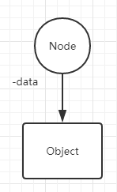
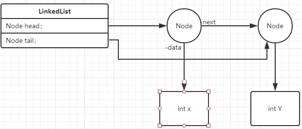

# Linked List

**Node**

Node is self-referential objects.

 It can connected another by reference links.

A group of Node,we call **Linked List**.

**Linked List**

Linked List is a collection data elements.It be similar array . The differed is:

1.Size Dynamically

2.Easy to insert to delete(It mean no need  deep into program in order to handle data.  )

---

## Different Type of Linked List

1.Singly Linked List

2.Doubly Linked List

3.Circular Linked List

---

## Singly Linked List

Singly Linked List contains a single reference to next node.

the first node we call **head **, and the last node call **tail**.


### Create Node

In every Node,it have two attribute:

`Object data;`:store the data,cause we don't know what data type will input so use Object Type.

When we add the data ,it also create the Node.

The Node attribute - `Object data;` is refer the Object item .It like this



`Node next;`:refer the next node.


Then, add  compiler and done the Node Class.

```java
class Node{
    public Object data;
    public Node next;
    
    public Node(){
        this(null,null);
    }
    public Node(Object data){
        this(data,null);
    }
    public Node(Object data,Node next){
        this.data = data;
        this.next = next;
    } 
}
```

---

### Create Linked List

First,Singly Linked List Class need two attribute:

`Node head;`

`Node tail;`

Same! write the attribute and compiler first:

```java
class LinkedList{
    Node head;
    Node tail;
    public LinkedList(){
        head = null;
        tail = null;
    }
}
```

Then we need to add methods！Here the basic methods which is Linked List needed.

1.`isEmpty() //determine` the Linked List is null or not.

2.`addToHead()//add the data and put it on the top.`

3.`addToTail()//add the data and put it on final position.`

4.`removeHead()//remove the data which refer head.`

5.`removeTail()//remove the data which refer tail.`

6.Comparator (Special,Tell later)


#### isEmpty()

We need to check the List is empty or not when  push the data to refer  and create the Node.

All first Node must refer head.

```java
public boolean isEmpty(){
    return head == null;
}
```


#### addToHead()

We should consider when the data incoming.It have tow situation here:

1.The List is empty；

2.The List had head before.

For the List is empty, we just make head refer Node :


```java
public void addToHead(Object data){
    Node newNode = new Node(data);
    if(isEmpty()){
        head = newNode;
        tail = newNode;
    }
}
```


When the List  of head had data，we should create another Node.


**Remember!!! This is addToHead() Method.The new Node always be a head.**

**Sequence is important!**

First, when the new Node create inside form addToHead(), in front of the new Node must shift to behind the new Node.

So,we new Node - `Node next;` refer in front of Node.


```java
public void addToHead(Object data){
    Node newNode = new Node(data);
    if(isEmpty()){
        head = newNode;
        tail = newNode;
    }else{
        	newNode.next = head;
    }
}
```

Then,make `Node head` refer new Node:


```java
public void addToHead(Object data){
  Node newNode = new Node(data);
    if(isEmpty()){
        head = newNode;
        tail = newNode;
    }else{
        	newNode.next = head;
        	head = newNode;
    }
}
```


#### addToTail()

Basically,it same addToHead().

 

Difference is the new Node must always be the last one.

**Sequence is:**

When the new Node inside:


we make sure new Node behind current Node,So:


`tail.next;` == `newNode.next;`

```java
public void addToTail(Object data){
  Node newNode = new Node(data);
    if(isEmpty()){
        head = newNode;
        tail = newNode;
    }else{
        	tail.next = newNode;
    }
}
```

Next,`Node tai;`refer to  the new Node.



```java
public void addToTail(Object data){
  Node newNode = new Node(data);
    if(isEmpty()){
        head = newNode;
        tail = newNode;
    }else{
        	tail.next = newNode;
        	tail = newNode;
    }
}
```


#### removeHead()

Consider situation

1.Null of List

2.One Node on List

3.More than one Node

For first situation:

Maybe you can use ArrayIndexOutOfBoundsException or other Exception

```java
public void removeHead(){
    if(isEmpty()){
        System.out.println("No data anymore!");
    }
}
```

Next,About One Node on the List.It means `next == null;`


It easy too!Make all attribute Null directly!.

```java
public void removeHead(){
    if(isEmpty()){
        System.out.println("No data anymore!");
    }
    
    Node current = head; // use othe Node to refer head,it more safely and appear the relation.
   
    if(current.next == null){
        head = null;
        tail = null;
    }
}
```


If Linked List have more than one items：


We just need to remove current of the head.

It mean `head = head.next;`


```java
public void removeHead(){
    if(isEmpty()){
        System.out.println("No data anymore!");
    }
    
    Node current = head; // use other Node to refer head,it more safely and appear the relation.
   
    if(current.next == null){
        head = null;
        tail = null;
    }else{
        head = head.next;
    }
}
```


#### removeTail()

Also,consider situation:

1.Null of List

2.One Node on List

3.More than one Node

The same way to solve1 and 2.

```java
public void removeHead(){
    if(isEmpty()){
        System.out.println("No data anymore!");
    }
    
    Node current = head; // use other Node to refer head,it more safely and appear the relation.
   
    if(current.next == null){
        head = null;
        tail = null;
    }
}
```

When the List have more than one Node.We want to remove the tail.

Consider that we can't use `tail == null;` directly! So we should find the Node one by one.


Tips is use looping to find which Node be refer by tail.

First Steps:


Second Steps:


```java
Node current = head;
while(current.next.next !=null){
    current =  current .next;
}
```

Next:


```java
Node current = head;
while(current.next.next !=null){
    current =  current .next;
  }
    	current.next = null;
    	
}    
```

The End:


```java
public Object removeTail(){ 
        if (isEmpty()) 
            System.out.println("No data anymore!");
        ListNode current = head;   
        if (current.next == null) {
            head = null;  // head = head.next;
            tail = null;
        } else {
            while (current.next.next != null ) {
                current = current.next;
        }
         current.next = null;
         tail = current;
     }    
}
```


